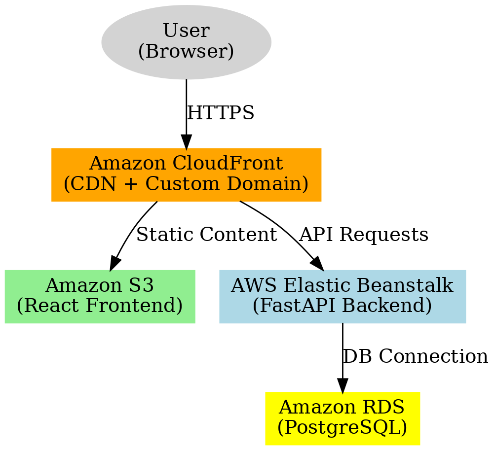

# Renewable Energy Dashboard

## Project Overview

The **Renewable Energy Dashboard** is a full-stack web application for managing and visualizing renewable energy data. It allows users to:

- **Authenticate** via JWT-based signup and login
- **Upload** CSV datasets of energy production and consumption
- **Visualize** hourly renewable energy data in interactive charts

The backend is built with **FastAPI** (Python) and **PostgreSQL**, while the frontend is implemented in **React** (TypeScript). The application can run locally via Docker Compose or be deployed on AWS using Terraform, Elastic Beanstalk, S3, and CloudFront.

---

## Table of Contents

1. [Prerequisites](#prerequisites)
2. [Environment Setup](#environment-setup)
3. [Local Setup](#local-setup)

   - [Backend](#backend)
   - [Frontend](#frontend)

4. [Docker Setup](#docker-setup)
5. [AWS Infrastructure with Terraform](#aws-infrastructure-with-terraform)
6. [AWS Deployment Instructions](#aws-deployment-instructions)

   - [Backend to Elastic Beanstalk](#backend-to-elastic-beanstalk)
   - [Frontend to S3 & CloudFront](#frontend-to-s3--cloudfront)
   - [Cache Invalidation](#cache-invalidation)

7. [API Usage](#api-usage)
8. [Architecture Diagram](#architecture-diagram)

---

## Live Frontend Test URL

[Visit the live frontend here](https://d1v02mozm1fy9b.cloudfront.net/login)

> **Note:** After logging in, if the data doesn't load or the date remains unchanged, please refresh the page once more. Thank you!

---

## Prerequisites

- **Python 3.10+**
- **Node.js 16+**
- **Docker & Docker Compose**
- **Terraform**
- **AWS CLI** (configured via `aws configure`)
- **AWS Account** with permissions for S3, RDS, EB, CloudFront

---

## Environment Setup

### Backend (`backend/.env`)

Create a file named `.env` in the `backend/` directory with the following content:

```dotenv
DATABASE_URL=postgresql+asyncpg://<DB_USER>:<DB_PASS>@<DB_HOST>:5432/<DB_NAME>
SECRET_KEY=<random-32-byte-hex>
ACCESS_TOKEN_EXPIRE_MINUTES=15
REFRESH_TOKEN_EXPIRE_DAYS=7
AWS_ACCESS_KEY_ID=<your-aws-key>
AWS_SECRET_ACCESS_KEY=<your-aws-secret>
AWS_REGION=us-west-2
S3_BUCKET=<your-frontend-s3-bucket>
```

### Frontend (`frontend/.env.development` & `frontend/.env.production`)

```dotenv
# .env.development
VITE_API_BASE_URL="http://localhost:8000"

# .env.production
VITE_API_BASE_URL="https://<your-cloudfront-domain>"
```

---

## Local Setup

### Backend

```bash
cd backend
python3 -m venv venv
source venv/bin/activate        # Windows: venv\Scripts\activate
pip install -r requirements.txt
alembic upgrade head
uvicorn app.main:app --reload --host 0.0.0.0 --port 8000
```

Open your browser at [http://localhost:8000/docs](http://localhost:8000/docs) to access the interactive API docs.

### Frontend

```bash
cd frontend
npm install
npm run dev
```

Visit [http://localhost:5173](http://localhost:5173) to view the React application.

---

## Docker Setup

Run the entire stack locally using Docker Compose:

```bash
docker-compose up --build
```

- **Backend:** FastAPI @ `http://localhost:8000`
- **Database:** PostgreSQL @ `localhost:5432`
- **Frontend:** React @ `http://localhost:3000` or `http://localhost:5173`

Stop with `Ctrl+C` and clean up containers:

```bash
docker-compose down
```

---

## AWS Infrastructure with Terraform

Terraform provisions the following AWS resources:

- **RDS (PostgreSQL)** for persistent data storage
- **Elastic Beanstalk** environment for the FastAPI backend
- **S3** bucket to host the React static site
- **CloudFront** distribution (two origins: S3 & EB) for CDN and HTTPS
- **IAM** roles and policies for secure service access

Navigate to the Terraform directory and run:

```bash
cd infra/terraform
terraform init
terraform plan -out=tfplan
terraform apply tfplan
```

_Terraform outputs will include the RDS endpoint, S3 bucket name, CloudFront domain, and Elastic Beanstalk URL._

---

## AWS Deployment Instructions

### Backend to Elastic Beanstalk

1. **Package the backend** (include `app/`, `requirements.txt`, your `Dockerfile` or Python files):

   ```bash
   zip -r backend-app.zip app/ requirements.txt Dockerfile
   ```

2. **Deploy with EB CLI** (recommended):

   ```bash
   cd backend
   eb init <app-name> --platform python-3.10 --region us-west-2
   eb use <environment-name>
   eb deploy
   ```

3. **Verify** at `https://<your-eb-env-url>/docs`

### Frontend to S3 & CloudFront

1. **Build the React app**:

   ```bash
   cd frontend
   npm run build
   ```

2. **Sync to S3**:

   ```bash
   aws s3 sync dist/ s3://<your-s3-bucket> --delete
   ```

3. **Ensure CloudFront** is configured with:

   - **Origin 1:** S3 bucket for static files
   - **Origin 2:** Elastic Beanstalk URL for API requests (path pattern `/api/*`)

### Cache Invalidation

After syncing new builds, invalidate CloudFront cache:

```bash
aws cloudfront create-invalidation --distribution-id <DIST_ID> --paths "/*"
```

---

## API Usage

### Authenticate and obtain JWT

```bash
curl -X POST "http://localhost:8000/users/login" \
     -H "Content-Type: application/json" \
     -d '{"email":"you@example.com","password":"yourPassword"}'
```

### Upload CSV data

```bash
curl -X POST "http://localhost:8000/energy/upload" \
     -H "Authorization: Bearer <ACCESS_TOKEN>" \
     -F "file=@path/to/data.csv"
```

Replace `localhost:8000` with your production domain as needed.

---

## Architecture Diagram



_Users access the application via CloudFront. Static content is served from S3, and API requests are routed to Elastic Beanstalk, which communicates with RDS._
